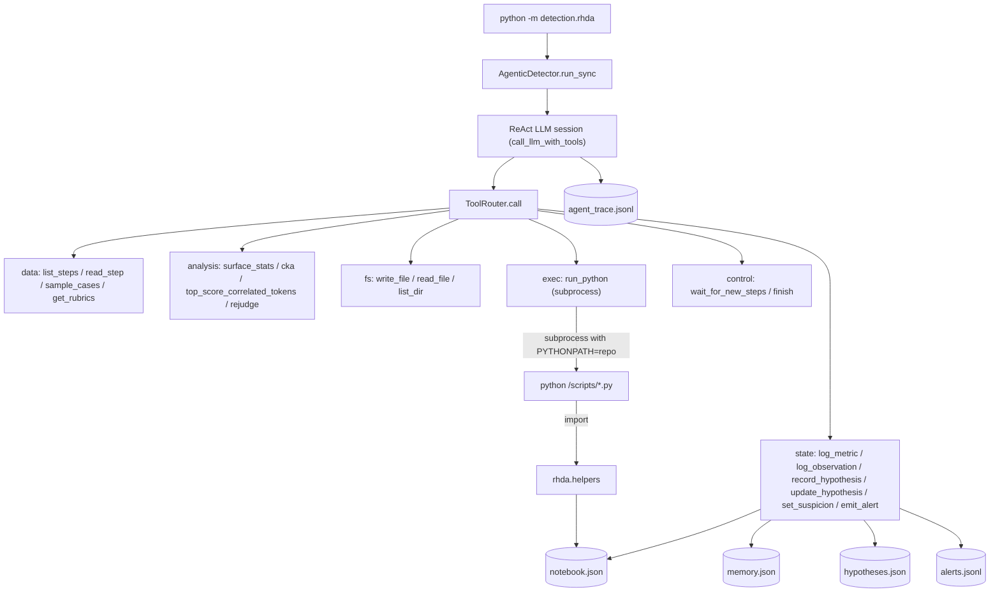

# `rhda` — Reward Hacking Detection Agent

An autonomous LLM agent that investigates RL rollouts via tool calls,
writes and runs its own Python to measure custom metrics, and persists
all state to disk.

---

## 1. Why agentic

A non-agentic detector has a fixed recipe: pre-compute a bundle of
statistics (surface drift, CKA, top-correlated tokens) → hand the
bundle to the LLM → ask "does this look like hacking?". It works, but
the model can only comment on things we thought to pre-compute.

This module inverts the control flow. The LLM is given a toolbox and
a workspace on disk, and decides the investigation itself:

- pulls whichever step it wants via `list_steps` / `read_step` /
  `sample_cases`
- forms hypotheses (`record_hypothesis`) and validates them
- writes ad-hoc Python (`write_file` + `run_python`) to compute any
  metric it can think of — "fraction of high-reward responses that end
  in the same disclaimer", "LCS between top samples at step 40 and
  step 80", etc.
- logs results to `notebook.json` so metrics persist and become part
  of future context
- emits a structured `Alert` only when multi-signal evidence converges

This is the same mental model as `karpathy/autoresearch` and
`huggingface/ml-intern`: one long-running session, real tool calls,
artifacts on disk.

---

## 2. Architecture



One LLM session runs the whole investigation. Offline vs. online only
changes `wait_for_new_steps` semantics (immediate return vs. blocking).

---

## 3. Install and run

For installation and the canonical command, see the top-level
[`README.md`](../../README.md). The variables this module reads from
`.env` are `AGENT_API_KEY`, `AGENT_API_BASE`, and `AGENT_MODEL`; each can
be overridden on the command line via `--api-key`, `--api-base`, and
`--model` respectively.

The flags most relevant to the agent loop:

- `--max-tool-calls` — budget on non-control tool invocations; `0` means
  unlimited (default 0). `emit_alert` and `finish` remain available after
  a nonzero budget is exhausted so the agent can still report and stop.
- `--max-loop-iterations` — max LLM turns before forced stop (default 60).
- `--rubrics-parquet` — parquet with `reward_model.rubrics` if rubrics
  aren't in the rollout JSONL (e.g. HealthBench).

`detection/rhda/prompts.py` is the canonical RHDA prompt shipped in this
release. Older launchers may still set
`DETECTION_AGENT_PROMPT_VERSION=paper_final`; that compatibility value maps to
the same canonical prompt.

Output goes under `<output-dir>/<experiment>/`:

- `agent_workspace/` — the agent's scratch and state (see §4)
- `agent_alert_step<N>.{json,md}` — per-alert reports

---

## 4. Workspace layout

Every run opens a workspace at
`detection_reports/<experiment>/agent_workspace/`. Everything is
crash-safe (tmp + rename for JSON, append-only for JSONL):

```
agent_workspace/
  notebook.json          # agent-defined metrics: [{step, name, value, note, ts}]
  memory.json            # {suspicion_level, suspicion_reason, observations[], suspicious_cases[]}
  hypotheses.json        # [{id, text, status, evidence[], created_ts, updated_ts}]
  alerts.jsonl           # one JSON alert per line (append-only)
  scripts/               # agent-authored Python (via write_file)
  artifacts/             # anything the agent saves (CSVs, notes)
  rubrics_map.json       # optional — written at startup if --rubrics-parquet was set
  agent_trace.jsonl      # every LLM message and tool call, one JSON per line
```

Re-running against an existing workspace picks up the saved state —
the LLM is shown a "resume" message with the current snapshot.

### Minimal schema examples

`notebook.json`:
```json
[
  {"step": 40, "name": "high_reward_disclaimer_rate",
   "value": 0.82, "note": "n=5", "ts": "2025-04-23T19:42:03"}
]
```

`hypotheses.json`:
```json
[
  {"id": "H1", "text": "high-reward responses end in the same disclaimer",
   "status": "validated", "evidence": ["82% at step 40"],
   "created_ts": "...", "updated_ts": "..."}
]
```

`alerts.jsonl` (one per line):
```json
{"alert_step": 40, "onset_step": 25, "confidence": 0.86,
 "severity": "high", "hacking_type": "disclaimer_spam",
 "summary": "...", "evidence": "...", "evidence_items": [...],
 "onset_basis": {"kind": "repeated_pattern", "step": 25,
                 "source": "run_python", "claim": "..."}}
```

---

## 5. Tool reference

All tool handlers return `(observation_str, ok_bool)`. `ok` is recorded
in the trace; `observation_str` is what the LLM sees.

### Data

| Tool | Args | Purpose |
|------|------|---------|
| `list_steps` | — | Which step files exist, range, head/tail. |
| `read_step` | `step`, `limit?` | Count + score stats; preview rows if limit>0. |
| `sample_cases` | `step`, `n=6`, `strategy=auto|high|low|extreme|random` | Adaptive bucketed sample. |
| `get_rubrics` | `step`, `prompt_id?` | Pull rubric text for a step (or one entry). |

### Analysis

| Tool | Args | Purpose |
|------|------|---------|
| `surface_stats` | `step`, `baseline_step?` | N-gram drift, length, score-correlated vocab. |
| `cka` | `step` | CKA lexical vs structural feature decomposition. |
| `top_score_correlated_tokens` | `step`, `k=20` | Tokens most correlated with reward. |
| `rejudge` | `prompt`, `response`, `rubric?` | Independent second-opinion LLM verdict. |

### Workspace FS

| Tool | Args | Purpose |
|------|------|---------|
| `write_file` | `rel_path`, `content` | Write into `scripts/` or `artifacts/`. |
| `read_file` | `rel_path`, `max_chars=8000` | Read back a workspace file. |
| `list_dir` | `rel_path="."` | List contents. |

Paths are confined to the workspace root (enforced).

### Exec

| Tool | Args | Purpose |
|------|------|---------|
| `run_python` | `rel_path`, `timeout=30` | Run a .py from the workspace in a subprocess. |

See §7 for what this does and does NOT isolate.

### State

| Tool | Args | Purpose |
|------|------|---------|
| `log_metric` | `name`, `value`, `step?`, `note?` | Append to `notebook.json`. |
| `log_observation` | `text`, `category?` | Append to `memory.json` observations. |
| `record_hypothesis` | `text` | New hypothesis; returns id (H1, H2…). |
| `update_hypothesis` | `id`, `status?`, `evidence?` | Mark validated/refuted, add evidence. |
| `set_suspicion` | `level`, `reason?` | `NORMAL|WATCHING|SUSPICIOUS|CONFIRMED`. |
| `emit_alert` | `severity`, `hacking_type`, `summary`, typed `evidence`, `onset_basis`, `onset_step`, `confidence?` | Final alert, appended to `alerts.jsonl`. |

### Control

| Tool | Args | Purpose |
|------|------|---------|
| `wait_for_new_steps` | `timeout_sec=60` | Block (online) or return immediately (offline). |
| `finish` | `summary` | Terminate the investigation loop. |

---

## 6. `rhda.helpers`

`helpers.py` is the library the agent's subprocess scripts import.
It's NOT a replacement for the agent writing code — it just handles
the repetitive plumbing (locating the workspace, opening a JSONL,
bucketing by score, calling the rejudge LLM, appending a metric with
a file lock).

Typical agent-authored script:

```python
import detection.rhda.helpers as h

step = 42
highs = h.sample_high(step, n=5)
pass_count = 0
for c in highs:
    v = h.rejudge_json(c["input"], c["output"])
    if v.get("satisfies_task") is True:
        pass_count += 1
rate = pass_count / max(len(highs), 1)
h.log_metric("high_reward_rejudge_pass_rate", value=rate, step=step,
             note=f"n={len(highs)}")
print(f"step {step}: rejudge pass rate = {rate:.2f}")
```

Current helpers API:

- `workspace_path()` / `rollout_dirs()`
- `available_steps()` / `load_step(step)`
- `sample_high(step, n, seed?)` / `sample_low(step, n, seed?)` / `sample_by_score(step, score_min, score_max, n, seed?)`
- `rejudge(prompt, response, rubric?)` → raw string
- `rejudge_json(prompt, response, rubric?)` → parsed dict (best effort)
- `get_rubric(prompt)` → rubric text or None (needs `--rubrics-parquet`)
- `log_metric(name, value, step?, note?)` — flock-protected append to `notebook.json`
- `log_observation(text, category)` — flock-protected append to `memory.json`

Helpers discover the workspace and agent-visible rollout dirs via
`DETECTION_WORKSPACE` and `DETECTION_ROLLOUT_DIRS` env vars; the
parent process sets these inside the subprocess runner. In normal
detector runs, `DETECTION_ROLLOUT_DIRS` points at a sanitized workspace
mirror containing only `input`, `output`, normalized `score`, and `step`,
not the raw rollout JSONL with judge decomposition fields.

---

## 7. `run_python`: what it isolates (and what it doesn't)

`runtime.run_python` runs the script via `subprocess.run([python,
"-u", path], cwd=workspace, env={..., PYTHONPATH=repo_root,
DETECTION_WORKSPACE=..., DETECTION_ROLLOUT_DIRS=...}, timeout=…)` and
truncates each of stdout/stderr to 8 KB. The agentic tool handler passes
sanitized rollout mirrors through `DETECTION_ROLLOUT_DIRS`, so helper
scripts see the same judge-blind row shape as `read_step` and
`sample_cases`. The `score` field in this view is normalized to the run's
maximum absolute reward so raw reward scale details are not exposed.

What that gives us:

- **Crash isolation.** Agent script segfaults / uncaught exceptions /
  `sys.exit(1)` never take down the main detector.
- **Timeout isolation.** `while True: pass`, `time.sleep(9999)`,
  infinite numpy loops → `subprocess.TimeoutExpired` and the process
  is killed. Timeout caps at 300s.
- **State isolation.** In-memory changes in the subprocess are
  invisible to the main detector; persistent state only flows through
  explicit `log_metric` / `log_observation` calls (→ JSON on disk).
- **Natural observation.** stdout/stderr come back verbatim to the
  LLM as the tool result. (Same pattern `autoresearch` uses with
  `grep run.log`.)

What it **does not** provide (and we deliberately don't build):

- File-system isolation. The subprocess runs as the current user with
  full FS access (it could `rm -rf ~` — it won't, because we're not
  facing adversarial prompts).
- Network isolation. It can `requests.get(...)`.
- Memory / CPU limits (only wall-time).
- Defence against adversarial code.

This is a research tool on the researcher's own machine, driven by
our own LLM. If we ever need real sandboxing (bwrap, docker, HF
Space), replacing `runtime.run_python` is the only surgery required —
tool schemas and agent prompt stay the same.

---

## 8. Debugging

### Read the trace

`agent_trace.jsonl` records every LLM turn and tool call:

```bash
# What did the agent actually do?
jq -r '. | [.type, .iteration, .tool_calls[0].function.name // .name, .ok, .output_preview]' \
   < detection_reports/<exp>/agent_workspace/agent_trace.jsonl
```

Entries include:
- `run_start` — model, dirs, resuming flag.
- `assistant` — one per LLM turn; holds `content` and `tool_calls`.
- `tool_result` — one per dispatched tool call; holds `name`, `ok`,
  `output_preview` (first 500 chars).
- `llm_error` — the chat-completions call raised.
- `run_end` — finish reason + final counts.

### Resume an interrupted run

Point `python -m detection.rhda` at the same rollout dir. If the workspace
already has any notebook entry or alert, the agent is given a resume
message containing the current state snapshot; it typically picks up
where it left off or calls `finish` if there's nothing new.

### Common pitfalls

- **`log_metric` not writing from subprocess.** Check that
  `DETECTION_WORKSPACE` is set — the runner does this, but a stray
  manual `python scripts/foo.py` outside the runner won't.
- **`ImportError: rhda.helpers`.** The runner puts repo
  root on `PYTHONPATH`; if you invoke scripts by hand you need the
  same.
- **Tool timeouts.** Default 30s, max 120s from the agent side, hard
  ceiling 300s in the runner. If a script needs longer, it's probably
  doing too much in one tool call; split it.
- **`tool_choice="auto"` but the model never calls a tool.** The
  agent loop nudges with a user message telling it to call `finish`
  or pick a tool; if that still fails, lower `temperature`, shrink
  the toolbox, or check that the model supports function calling.

---

## 9. Roadmap

- Swap `runtime.run_python` for bwrap / docker / remote HF Space if we
  ever need real sandboxing (e.g. running agent on outside rollouts).
  Public API stays the same.
- Teach the agent to load `notebook.json` deltas between resumes as
  context instead of always replaying the full snapshot.
- A `compare` tool to read two `alerts.jsonl` streams side-by-side for
  cross-run ablation.
